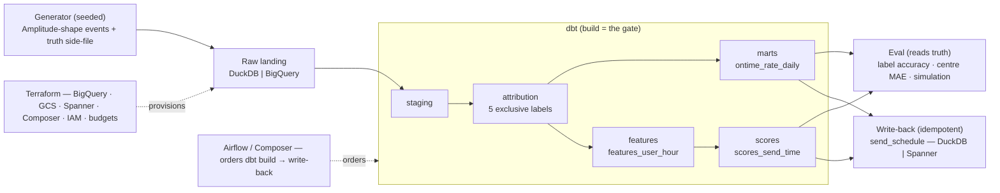

# On-Time Rate Recovery Pipeline

A deterministic, seeded batch pipeline that takes daily-prompt app events in the
**Amplitude raw-export shape**, attributes every late or missed response to
exactly one cause, learns a per-user send time, and recommends a schedule that
recovers on-time rate — end to end, from a frozen fixture to an idempotent
serving table, provably the same answer on every run and on real GCP.

It runs two ways from one codebase: **local** (DuckDB, meter off) for the whole
correctness story, and **cloud** (BigQuery + Spanner + Composer, ask-first) for
the same numbers at the production seam. Everything below the fold is the local
path; the cloud path is the runbook in [docs/DEPLOYMENT.md](docs/DEPLOYMENT.md).

## Results at a glance

Every number here is rendered by `make readme` from `tests/pins.py` (which the
committed [docs/RESULTS.md](docs/RESULTS.md) blocks are pinned to) — never typed
by hand, and regenerated byte-identically under `make test`.

<!-- readme:begin -->
| metric | tiny (frozen fixture) | medium (2,000 users, unfrozen) |
|---|---|---|
| label accuracy vs generator truth | 1.000 | — |
| reachable-centre MAE (hours) | 0.816201 | 0.352354 |
| reachable-window coverage | 0.6000 | 0.7345 |
| built on-time rate | 0.609756 | 0.461143 |
| simulated lift (recommended − baseline) | -0.033333 | +0.162371 |

Tiny's lift is a regression pin (a 20-user cohort bin-tie), not a result; medium is the proof. The simulation is counterfactual, not an A/B — see [docs/INSIGHT.md](docs/INSIGHT.md).
<!-- readme:end -->


On the 2,000-user profile the served schedule lifts the simulated on-time rate
well above baseline — the proof (see the chart and the table above). Read the
honest caveats first: [docs/INSIGHT.md](docs/INSIGHT.md).

## How it fits together



The truth side-file is **never** a pipeline source — only `eval/` reads it, to
score the pipeline against the generator's assigned causes.

## Quickstart (local, no cloud, ~2 minutes)

A cold clone reaches a served schedule with no GCP account and no cost. Every
command below is offline and free.

```
make setup                     # uv sync + pre-commit
make seed PROFILE=tiny         # Phase 1 — regenerate the raw events (matches the frozen fixture)
make dbt-build PROFILE=tiny    # Phases 2–7 — stage, attribute, mart, score on DuckDB
make eval PROFILE=tiny         # Phases 3/5 — label accuracy + reachable-centre MAE vs truth
make report PROFILE=tiny       # Phase 4 — the on-time-rate mart
make simulate PROFILE=tiny     # Phase 6 — the counterfactual simulation (checks the RESULTS block)
make writeback PROFILE=tiny    # Phase 8 — idempotent upsert into send_schedule
make pipeline PROFILE=tiny     # Phase 8 — the whole chain in one process → `pipeline OK: tiny`
```

`make test` runs the offline suite (no services, no network); `make review-gate`
adds ruff + `make check-docs`. The cloud path — BigQuery build, Spanner
write-back, Composer-scheduled DAG — is ask-first and metered:
[docs/DEPLOYMENT.md](docs/DEPLOYMENT.md).

## Who does what (stack roles)

| Layer | Tool | Role here | Local stand-in |
|---|---|---|---|
| Generation | Python + pydantic | Seeded Amplitude-shape events + a truth side-file | — |
| Landing | Python | Fixtures → raw tables | DuckDB `raw` schema |
| Transform | dbt | staging → attribution → marts → features → scores; `dbt build` is the gate | DuckDB |
| Warehouse | BigQuery | Production transform + federated dims | DuckDB |
| Dimensions | Spanner (SCD2) | `dim_user` home BigQuery federates from | DuckDB seed |
| Scoring | dbt model | `scores_send_time` — the served recommendation, in SQL | DuckDB |
| Eval | Python | Label accuracy · centre MAE · counterfactual simulation (reads truth) | — |
| Serving | Spanner | Idempotent `send_schedule` write-back | DuckDB stand-in |
| Orchestration | Airflow / Composer | Orders `dbt build → write-back` (no logic) | Docker-local Airflow |
| Infra | Terraform | BigQuery · GCS · Spanner · Composer · IAM · budgets, meter-off by default | — |

## Docs index

- [docs/ARCHITECTURE.md](docs/ARCHITECTURE.md) — the spec: data model, labels,
  metrics, boundaries, the Amplitude-export mapping, deployment posture, gotchas.
- [docs/PHASES.md](docs/PHASES.md) — the build plan, phase by phase, each with a
  one-line Done-when.
- [docs/METRICS.md](docs/METRICS.md) — the single definition of every served
  metric (grain, numerator, denominator, null policy).
- [docs/RESULTS.md](docs/RESULTS.md) — the counterfactual simulation, one
  generated block per profile.
- [docs/AB_DESIGN.md](docs/AB_DESIGN.md) — the production A/B: randomisation,
  holdout, power table.
- [docs/INSIGHT.md](docs/INSIGHT.md) — the one-page honest read: what the numbers
  mean and what they do not.
- [docs/DEPLOYMENT.md](docs/DEPLOYMENT.md) — GCP bring-up, cost, teardown (ask-first).
- [docs/ROADMAP.md](docs/ROADMAP.md) — what comes next, in order, and the one-week cut.
- [DECISIONS.md](DECISIONS.md) — the why-not-X log. [BACKLOG.md](BACKLOG.md) —
  deferred findings with triggers. [CLAUDE.md](CLAUDE.md) — the operating manual.

## Design principles

- **Deterministic.** Same seed + profile → byte-identical output. No clock on the
  data path; `computed_as_of` is data-derived. A drift is a red test, never a
  rewritten constant.
- **Truth isolation.** The generator's truth is a side-file only `eval/` reads —
  never a dbt source, never a model input.
- **The model is a dbt model.** The send-time recommendation is SQL
  (`scores_send_time`); Python never computes a score the pipeline serves.
- **Meter off by default.** Every cloud module is `count`-gated behind a toggle
  that defaults false; `terraform destroy` leaves nothing billable.

Phases 0–13 are complete: the pipeline is complete on correctness, not yet on
scale or a scheduled cloud run. What comes next, in order, is
[docs/ROADMAP.md](docs/ROADMAP.md) — a reframed front door, remote Terraform
state, one layering fix, then a real-scale cost run, a non-circular holdout
eval, a Composer-runnable DAG, an append-only landing and the CI parity leg —
each item a [BACKLOG.md](BACKLOG.md) row with a trigger.
