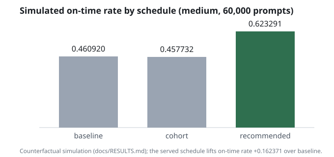
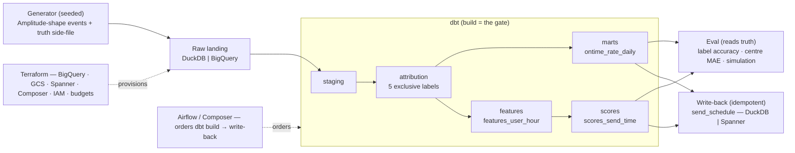

# On-Time Rate Recovery Pipeline

A daily-prompt app lives on one habit: the prompt goes out, and the user has a
short window to answer. Miss the window and the habit slips; slip a few days and
the user is on the way out. Most analytics record every miss the same way, so
reliability bugs read as disengagement and scheduling problems read as apathy.
This pipeline separates the three causes of a miss, hands the two the app
caused back to engineering, and fixes the one it can: it learns when each user
is actually reachable and recommends a send time inside their cohort's shared
moment. It runs end to end on a laptop with no cloud account, and the same code
runs on BigQuery and Spanner, ordered by an Airflow DAG — locally against those
services, and as a scheduled run on Cloud Composer (proven live, then torn down).
The results
block and the chart below are generated from pinned test data and regenerate
byte for byte; no figure in them is typed by hand.

## The problem: three kinds of "late" that look the same

When a response arrives late or never, one row says "missed". Behind it are
three different stories with three different owners:

- **The upload failed or stalled.** The user answered in time; the app recorded
  them late. An engineering bug wearing a user's face.
- **The prompt never arrived.** Push delivery failed, or notifications were off.
  The user never had a chance. An infrastructure fault.
- **The prompt arrived at the wrong hour.** Asleep, commuting, in a meeting: the
  user could not respond before the window closed. A scheduling problem, and the
  one that is fixable from the data side.

The event stream already carries what tells them apart: three clocks on every
event (when the client did it, when the server received it, when the batch was
uploaded) and the delivery receipt. Joining them up is the whole trick.

## What the pipeline does

1. **Attributes every prompt to exactly one cause** from events in the shape of
   an Amplitude raw export: `on_time`, `upload_fault`, `delivery_fault`,
   `timing_gap`, or an explicit `unattributed` bucket whose share a test caps.
   The cap is what makes the on-time rate trustworthy: nothing is quietly folded
   into "late".
2. **Learns when each user is reachable** from their organic app opens, not
   from their prompt responses, which only exist when the prompt already found
   them. A user with a handful of opens borrows strength from their cohort.
3. **Recommends a send time per user**, clamped to the cohort's band so the
   product keeps its shared moment, and writes it to a serving table with an
   upsert that is safe to run twice.
4. **Checks itself against ground truth it cannot see.** The events are
   generated with the true cause of every miss written to a side-file the
   pipeline never reads; an evaluator scores the labels and the learned hours
   against it.
5. **Estimates the effect** with a counterfactual simulation, and ships the
   design of the A/B that would measure it for real.

## What it found

<!-- readme:begin -->
**On the 2,000-user profile the recommended schedule lifts the simulated on-time rate from 46% to 62% (+16 points).** Every number here is rendered by `make readme` from `tests/pins.py` (which the committed [docs/RESULTS.md](docs/RESULTS.md) blocks are pinned to) — never typed by hand, regenerated byte-identically under `make test`.

| metric | tiny (frozen fixture) | medium (2,000 users, unfrozen) |
|---|---|---|
| label accuracy vs generator truth | 1.000 | — |
| reachable-centre MAE (hours) | 0.816201 | 0.352354 |
| reachable-window coverage | 0.6000 | 0.7345 |
| built on-time rate | 0.609756 | 0.461143 |
| simulated lift (recommended − baseline) | -0.033333 | +0.162371 |

Tiny's lift is a regression pin (a 20-user cohort bin-tie), not a result; medium is the proof. The simulation is counterfactual, not an A/B — see [docs/INSIGHT.md](docs/INSIGHT.md).
<!-- readme:end -->



The gain is almost entirely the third cause recovered: prompts that were
delivered and went unanswered because they arrived at the wrong local hour, now
sent when the user is reachable. Three caveats come with it, and they are the
point rather than the fine print. The small frozen fixture shows a slightly
negative lift: one cohort's pooled open histogram has a two-way tie, so its
anchor lands on the wrong hour. It is kept as a regression pin rather than
hidden. The simulation re-draws outcomes under the
same rule that generated the data, so it proves the model learns the pattern it
was given, not that the pattern matches real users. The real test is the A/B in
[docs/AB_DESIGN.md](docs/AB_DESIGN.md), specified with a power table but not run.
The one-page honest read is [docs/INSIGHT.md](docs/INSIGHT.md).

## Why the numbers can be trusted

- **Ground truth the pipeline cannot see.** The generator's assigned causes live
  in a side-file only the evaluator reads; a test greps every pipeline
  directory for the word. Label accuracy against that truth is in the table.
- **Same input, same bytes.** A fixed seed gives byte-identical events; no
  clock touches the data path; every comparison sorts by a declared key. A drift
  is a red test, never a rewritten constant.
- **The model is a dbt model.** The served recommendation is SQL
  (`scores_send_time`). Python never computes a number the pipeline serves, so
  there is no second scorer to disagree with the table.
- **One definition per metric.** Grain, numerator, denominator and null policy
  for every served metric live in [docs/METRICS.md](docs/METRICS.md); the
  denominator identities are dbt tests.
- **Proven on the real warehouse.** The BigQuery build reproduces every DuckDB
  golden and pin byte for byte, and the Spanner write-back hashes to the same
  serving table as the local one.

## Quickstart — see it run (local, no cloud, ~2 minutes)

A cold clone reaches a served schedule with no GCP account and no cost. Every
command below is offline and free.

```
make setup                     # uv sync + pre-commit
make seed PROFILE=tiny         # regenerate the raw events (matches the frozen fixture)
make dbt-build PROFILE=tiny    # stage, attribute, mart, score on DuckDB
make eval PROFILE=tiny         # label accuracy + reachable-centre MAE vs truth
make report PROFILE=tiny       # the on-time-rate mart
make simulate PROFILE=tiny     # the counterfactual simulation (checks the RESULTS block)
make writeback PROFILE=tiny    # idempotent upsert into send_schedule
make pipeline PROFILE=tiny     # the whole chain in one process → `pipeline OK: tiny`
```

`make test` runs the offline suite (no services, no network); `make review-gate`
adds ruff and `make check-docs`. The cloud path (BigQuery build, Spanner
write-back, Composer-scheduled DAG) is ask-first and metered:
[docs/DEPLOYMENT.md](docs/DEPLOYMENT.md).

## How it fits together



The truth side-file is **never** a pipeline source; only `eval/` reads it, to
score the pipeline against the generator's assigned causes.

| Layer | Tool | Role here | Local stand-in |
|---|---|---|---|
| Generation | Python + pydantic | Seeded Amplitude-shape events + a truth side-file | — |
| Landing | Python | Fixtures → raw tables | DuckDB `raw` schema |
| Transform | dbt | staging → attribution → marts → features → scores; `dbt build` is the gate | DuckDB |
| Warehouse | BigQuery | Production transform + federated dims | DuckDB |
| Dimensions | Spanner (SCD2) | `dim_user` home BigQuery federates from | DuckDB seed |
| Scoring | dbt model | `scores_send_time`: the served recommendation, in SQL | DuckDB |
| Eval | Python | Label accuracy · centre MAE · counterfactual simulation (reads truth) | — |
| Serving | Spanner | Idempotent `send_schedule` write-back | DuckDB stand-in |
| Orchestration | Airflow / Composer | Orders `dbt build → write-back` (no logic) | Docker-local Airflow |
| Infra | Terraform | BigQuery · GCS · Spanner · Composer · IAM · budgets, meter off by default | — |

## How it was built

Every step was written against a spec with named invariants before any
mechanism, and had to pass two offline checks: the review gate (the test suite,
lint, the docs guard) and a mutation sweep that breaks each guard on purpose and
expects a red test. A frozen fixture only one gated command may rewrite, and
only with a signed-off spec line, plus the truth-isolation grep, hold the data
still. The work was done with an
AI coding assistant inside that loop; the loop, not the assistant, is what kept
the numbers honest. [docs/PROCESS.md](docs/PROCESS.md) is the one page on how:
what the machine checked, what held the data still, what the assistant did and
did not. The operating manual is [CLAUDE.md](CLAUDE.md); the why-not-X log is
[DECISIONS.md](DECISIONS.md); deferred findings with their triggers are in
[BACKLOG.md](BACKLOG.md).

## Where to read next

- [docs/INSIGHT.md](docs/INSIGHT.md) — the one-page honest read: what the
  numbers mean and what they do not.
- [docs/PROCESS.md](docs/PROCESS.md) — how it was built and what kept it
  honest: the gate, the mutation sweep, the frozen fixture, the pins, the
  review loop, the assistant's part.
- [docs/ARCHITECTURE.md](docs/ARCHITECTURE.md) — the spec: data model, labels,
  metrics, boundaries, the Amplitude-export mapping, deployment posture, gotchas.
- [docs/METRICS.md](docs/METRICS.md) — the single definition of every served
  metric.
- [docs/RESULTS.md](docs/RESULTS.md) — the counterfactual simulation, one
  generated block per profile, and the live cloud run.
- [docs/AB_DESIGN.md](docs/AB_DESIGN.md) — the production A/B: randomisation,
  holdout, power table.
- [docs/DEPLOYMENT.md](docs/DEPLOYMENT.md) — GCP bring-up, cost, teardown
  (ask-first).
- [docs/PHASES.md](docs/PHASES.md) — how it was built, step by step, each with a
  one-line Done-when.
- [docs/ROADMAP.md](docs/ROADMAP.md) — what comes next, in order, and the
  one-week cut.

The pipeline is complete on correctness, proven at real scale (200,000 users on
BigQuery), and proven on a scheduled cloud run: the `ontime_cloud` DAG runs on
Cloud Composer (dbt as Cosmos, one task per model; the landings and write-back as
Kubernetes pods), and its cloud-written schedule is byte-identical to the frozen
local truth — run live 2026-09-04, then torn down (`docs/RESULTS.md`). The
[docs/ROADMAP.md](docs/ROADMAP.md) plan is complete.
